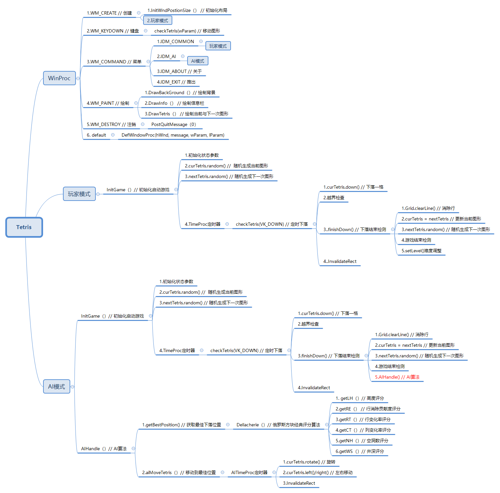
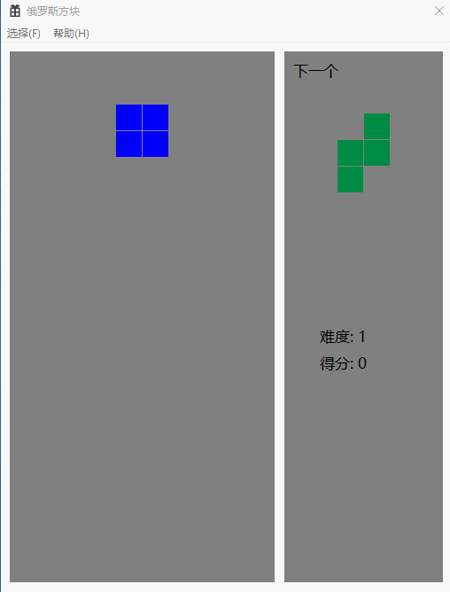

## 俄罗斯方块

- 采用C++与WinAPI方式实现，分为**普通玩家模式**与**AI模式**
- 思维导图

### 玩家模式

#### 预览

### AI模式
> [pierre-dellacheries算法详情](http://imake.ninja/el-tetris-an-improvement-on-pierre-dellacheries-algorithm)
#### 预览

> Gif制作工具略有卡顿 :)

#### 消除行数

> 尚未测得，目前测试环境下，测试时间以及消除行数大约为**12小时60W行**，最终人为停止测试。
